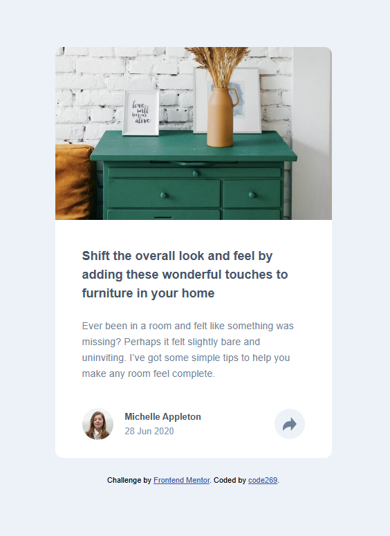
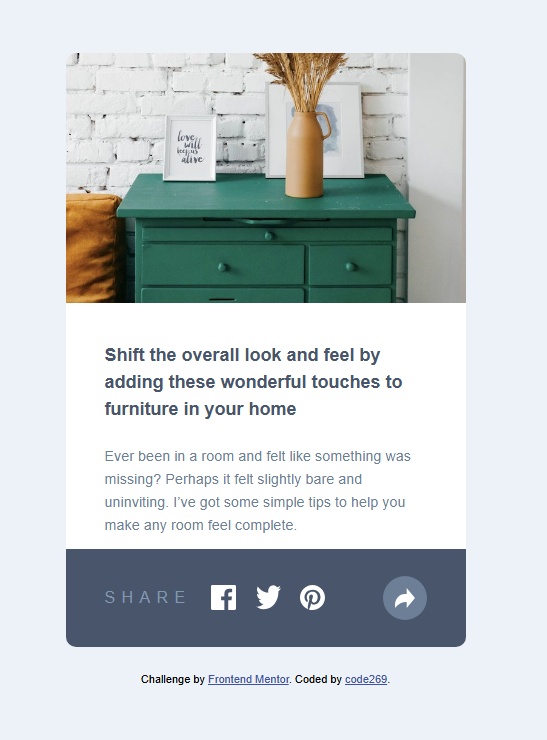
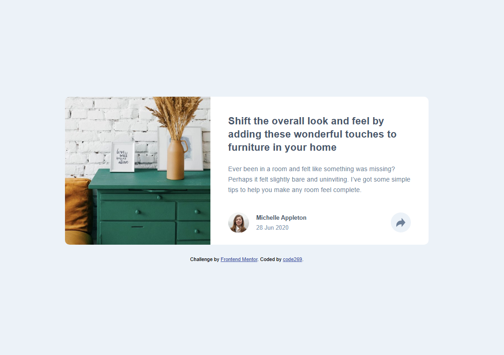
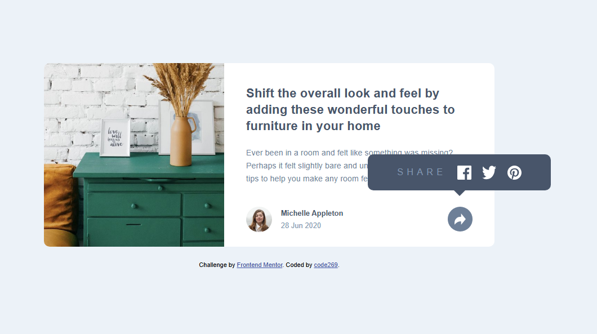

# Frontend Mentor - Article preview component solution

This is a solution to the [Article preview component challenge on Frontend Mentor](https://www.frontendmentor.io/challenges/article-preview-component-dYBN_pYFT). Frontend Mentor challenges help you improve your coding skills by building realistic projects.

## Table of contents

- [Overview](#overview)
  - [The challenge](#the-challenge)
  - [Screenshot](#screenshot)
  - [Links](#links)
- [Author](#author)

## Overview

### The challenge

Users should be able to:

- View the optimal layout for the component depending on their device's screen size
- See the social media share links when they click the share icon

### Screenshot

Mobile

Mobile (Active)

Desktop

Desktop (Active)

### Links

- Solution URL: [Frontend Mentor](https://www.frontendmentor.io/solutions/article-preview-component-2i5BC5lzcB)
- Live Site URL: [GitHub Pages](https://code269.github.io/fem-article-pv-component/)

## Author

- Website - [GitHub](https://github.com/code269)
- Frontend Mentor - [@code269](https://www.frontendmentor.io/profile/code269)
